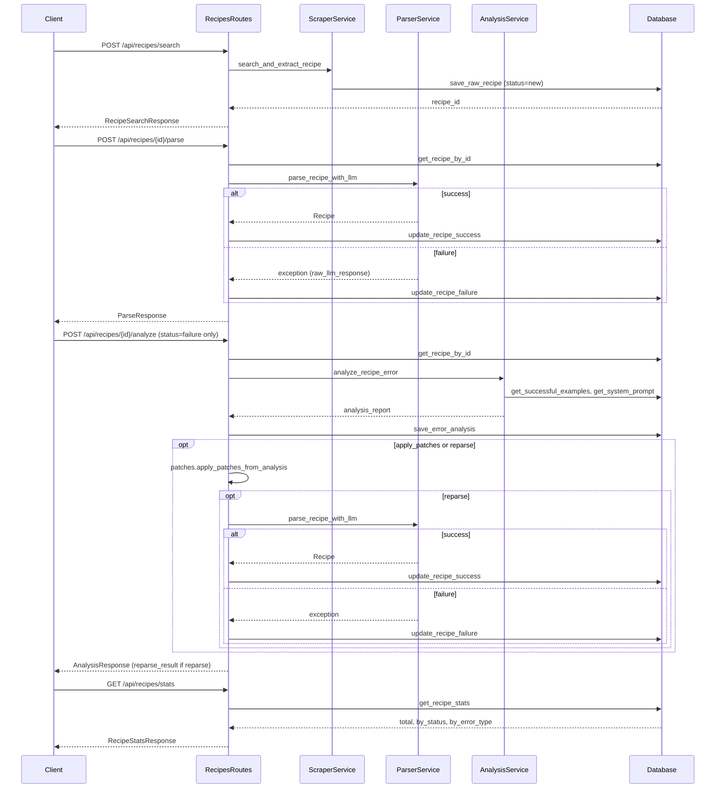

# Backend API — Agents Guide

Guide for AI coding agents working on the **backend API only**. Do not modify or document root-level CLI scripts (`recipe_parse_cli.py`, `recipe_scraper.py`, `recipe_parser.py`, `recipe_analyze_error.py`, etc.).

---

## Overview

- **App:** FastAPI "Recipe Search and Management API" for [russianfood.com](https://www.russianfood.com) recipes.
- **Entry:** [backend/main.py](backend/main.py); run via `python -m backend.main` or uvicorn on `API_HOST:API_PORT` (default `0.0.0.0:8003`).
- **Scope:** Backend API and its flows only.

---

## Architecture

```
backend/
  main.py           # FastAPI app, CORS, request-ID middleware, global exception handler, route registration
  config.py         # Loads from root config_section; adds API_HOST, API_PORT, LOG_*, SYSTEM_PROMPT_PATH, ERROR_ANALYSIS_PROMPT_PATH, PROJECT_ROOT
  logging_config.py # setup_logging, get_logger, request_id context (ContextVar), RequestIDFilter, console + RotatingFileHandler to log/backend.log
  api/
    dependencies.py # get_request_id_dependency (X-Request-ID or generate), get_logger_dependency
    routes/
      recipes.py    # All /api/recipes/* endpoints; analyze route uses patches.apply_patches_from_analysis when apply_patches or reparse
  database/
    __init__.py     # Re-exports db (from database/db.py)
    db.py           # SQLite: init_database, save_raw_recipe, get_recipes_by_status, get_recipe_by_id, update_recipe_success, update_recipe_failure, save_error_analysis, get_error_analyses_by_recipe_id, get_recipe_stats, delete_recipe
  models/
    schemas.py      # Pydantic: RecipeSearchRequest/Response, ParseRequest/Response, RecipeListItem/ListResponse, RecipeDetailResponse, RawRecipeResponse, ParsedRecipeSchema, IngredientSchema, ParsedRecipeDetailResponse, AnalysisRequest/Response/ListResponse, DeleteResponse, ErrorResponse, HealthResponse, RecipeStatsResponse
  services/
    scraper_service.py   # Selenium + BeautifulSoup, russianfood.com: init_driver, search_recipe, extract_recipe_content, search_and_extract_recipe -> {title, recipe_text, url}
    parser_service.py    # LLM (together_ai, vercel_ai, mistral_ai, deepseek_ai): get_system_prompt (appends patches.get_system_prompt_append), format_recipe_for_llm, get_llm_client, call_llm, parse_recipe_with_llm -> Recipe (from recipe_models)
    analysis_service.py  # LLM for failed recipes: get_error_analysis_prompt, read_code_file, get_successful_examples, format_analysis_context, analyze_recipe_error -> analysis_report dict
```

---

## Endpoints

| Method | Path | Request | Response | Purpose |
|--------|------|---------|----------|---------|
| GET | `/` | — | `{name, version, docs, health}` | Root / info |
| GET | `/health` | — | `HealthResponse` | Health check |
| POST | `/api/recipes/search` | `RecipeSearchRequest` | `RecipeSearchResponse` (201) | Search russianfood.com, extract, save raw; returns `recipe_id`, `status=new`, `title`, `url` |
| POST | `/api/recipes/{recipe_id}/parse` | `ParseRequest` (optional `model`) | `ParseResponse` | Parse with LLM; on success `status=success` + `parsed_recipe`; on failure `status=failure` + `error`; DB updated in both cases |
| GET | `/api/recipes/stats` | `?date_from=` (optional), `?date_to=` (optional) | `RecipeStatsResponse` | Total, by_status (new/success/failure), by_error_type (for failures); optional ISO date filters on created_at |
| GET | `/api/recipes` | `?status_filter=` (optional) | `RecipeListResponse` | List recipes, optional filter `new` / `success` / `failure` |
| GET | `/api/recipes/{recipe_id}` | — | `RecipeDetailResponse` | Full recipe row |
| GET | `/api/recipes/{recipe_id}/raw` | — | `RawRecipeResponse` | `title`, `recipe_text`, `url` |
| GET | `/api/recipes/{recipe_id}/parsed` | — | `ParsedRecipeDetailResponse` | Parsed schema or error blob; `error` if `new` or `failure` |
| POST | `/api/recipes/{recipe_id}/analyze` | `AnalysisRequest` (optional `model`, `apply_patches`, `reparse`) | `AnalysisResponse` (201) | Run error analysis for `status=failure` only; save to `error_analyses`. If `apply_patches`: merge analysis `patches` into `patches/` via `patches.apply_patches_from_analysis`. If `reparse`: after apply, re-parse and update DB; response includes `reparse_result` {status, parsed_recipe?, error?} |
| GET | `/api/recipes/{recipe_id}/analyses` | — | `AnalysisListResponse` | All analyses for a recipe |
| DELETE | `/api/recipes/{recipe_id}` | — | `DeleteResponse` | Delete recipe and its analyses (CASCADE) |

All `/api/recipes/*` handlers use `get_request_id_dependency` and return `X-Request-ID` via middleware. 4xx/5xx use `HTTPException` or global handler → `ErrorResponse` with `request_id`.

---

## Request/Response Flows

**Search**

`POST /api/recipes/search` → `search_and_extract_recipe(query)` (scraper: init_driver, search_recipe, extract_recipe_content, quit) → `db.save_raw_recipe(...)` → `RecipeSearchResponse`.

**Parse**

`POST /api/recipes/{id}/parse` → `db.get_recipe_by_id` → `parse_recipe_with_llm(raw_recipe_data, model)` (system_prompt from `parser_service.get_system_prompt`, which appends `patches.get_system_prompt_append()`; `recipe_models.Recipe`, `response_cleanup.clean_llm_response`) → on success: `db.update_recipe_success`; on exception: `db.update_recipe_failure` (and `error.raw_llm_response` if present) → `ParseResponse` with `status` and either `parsed_recipe` or `error`.

**Analyze (failure only)**

`POST /api/recipes/{id}/analyze` → `db.get_recipe_by_id`; if `status != 'failure'` → 400 → `analyze_recipe_error(recipe_id, model)` (error_analysis_prompt, `recipe_models`, `response_cleanup`, successful examples from DB) → `db.save_error_analysis` → if `AnalysisRequest.apply_patches` or `reparse`: `patches.apply_patches_from_analysis(analysis_report)` → if `reparse`: `parse_recipe_with_llm` (with updated patches), `db.update_recipe_success` or `db.update_recipe_failure` → `AnalysisResponse` (includes `reparse_result` when `reparse=True`).

**Stats**

`GET /api/recipes/stats?date_from=&date_to=` → `db.get_recipe_stats(date_from, date_to)` → `RecipeStatsResponse` (total, by_status, by_error_type).

**List / Get / Delete**

Straightforward `db` calls; no services. `GET .../raw` and `.../parsed` derive from `db.get_recipe_by_id`.

### Flow: Search → Parse → Analyze



---

## Services

### scraper_service

- Config from `config_section`: `BASE_URL`, `SEARCH_URL`, `IMPLICIT_WAIT`, `PAGE_LOAD_WAIT`, `SEARCH_RESULTS_WAIT`, `ELEMENT_WAIT_TIMEOUT`, `MIN_TEXT_LENGTH_*`, `MAX_LIST_ITEMS`, `MAX_PARAGRAPHS`, `CHROME_HEADLESS`, `CHROME_OPTIONS`.
- `search_and_extract_recipe(recipe_name, headless)` is the main API used by the route.
- Returns `{title, recipe_text: List[str], url}`; raises `ValueError` if not found or extraction fails.

### parser_service

- Uses `config_section`: `LLM_PROVIDER`, `*API_KEY_ENV_VAR`, `*API_BASE_URL`, `*AVAILABLE_MODELS`, `DEFAULT_MODEL`, `SYSTEM_PROMPT_FILE`, `LLM_TEMPERATURE`.
- Root imports: `recipe_models.Recipe`, `response_cleanup.clean_llm_response`, `patches.get_system_prompt_append`.
- `get_system_prompt()` reads `system_prompt.txt` and appends `patches.get_system_prompt_append()` when present (same as root recipe_parser).
- `parse_recipe_with_llm(raw_recipe_data, model, provider)` returns `Recipe`; on JSON/validation errors attaches `raw_llm_response` to the exception for analysis.

### analysis_service

- Uses `config_section`: `LLM_PROVIDER`, `DEFAULT_ANALYSIS_MODEL`, `ERROR_ANALYSIS_PROMPT_FILE`, `MAX_SUCCESSFUL_EXAMPLES`, `*AVAILABLE_MODELS`.
- Root imports: `parser_service.get_llm_client`, `call_llm`, `get_system_prompt`; reads `recipe_models.py`, `response_cleanup.py` via `read_code_file`.
- `analyze_recipe_error(recipe_id, model)` expects `status=failure`, returns `analysis_report` dict; used only after parse failure.

---

## Database

- **File:** `config_section.DATA_DIR / config_section.DB_PATH` → `data/recipes.db` (project root).
- **Lazy init:** `init_database()` is called at the start of each `db.*` function; creates tables if missing.
- **Tables:**
  - `recipes`: id, recipe_name, source_url, raw_title, raw_recipe_text (JSON list), status (`new` | `success` | `failure`), parsed_recipe (JSON), error_type, error_message, error_traceback, llm_response_text, created_at, updated_at, parsed_at. Migration in code: add `llm_response_text` if absent.
  - `error_analyses`: id, recipe_id (FK → recipes ON DELETE CASCADE), analysis_report (JSON), recommendations_summary, created_at.
- **db API** ([backend/database/db.py](backend/database/db.py)): `init_database`, `save_raw_recipe`, `get_recipes_by_status`, `get_recipe_by_id`, `update_recipe_success`, `update_recipe_failure`, `save_error_analysis`, `get_error_analyses_by_recipe_id`, `get_recipe_stats(date_from?, date_to?)`, `delete_recipe`.
- `from backend.database import db` resolves to this module (via [backend/database/__init__.py](backend/database/__init__.py)).

---

## Configuration and Assets

### backend/config.py

Re-exports from root `config_section` (DB, LLM, prompts, scraper, etc.) and defines: `API_HOST`, `API_PORT`, `API_RELOAD`, `LOG_LEVEL`, `LOG_TO_FILE`, `LOG_DIR` (default `log/` in project root), `PROJECT_ROOT`, `SYSTEM_PROMPT_PATH`, `ERROR_ANALYSIS_PROMPT_PATH`. `load_dotenv()` in config.

### Prompt and code assets (paths from project root)

- `system_prompt.txt` — parsing LLM (parser_service).
- `error_analysis_prompt.txt` — analysis LLM (analysis_service).
- `recipe_models.py`, `response_cleanup.py` — read by analysis_service as context.

### Backend-only paths

`LOG_DIR` and `log/backend.log` (from [backend/logging_config.py](backend/logging_config.py)).

---

## Middleware and Error Handling

- **CORS:** `allow_origins=["*"]`, `allow_credentials=True`, `allow_methods/headers=["*"]`.
- **Request ID:** `X-Request-ID` from header or new UUID; `set_request_id` / `clear_request_id` around `call_next`; `response.headers["X-Request-ID"]`.
- **Global exception:** `Exception` → 500, `ErrorResponse(error="Internal server error", detail=..., request_id=...)`.
- Routes use `HTTPException` for 400/404/500 with `detail`; parse route returns 200 with `ParseResponse.status=failure` and `error` for parse failures.

---

## Logging

- **logging_config:** `setup_logging()` on import; formatter includes `[%(request_id)s]`; `RequestIDFilter`; `contextvars` for `request_id`.
- Handlers: `StreamHandler` (stdout) and, if `LOG_TO_FILE`, `RotatingFileHandler` on `LOG_DIR/backend.log` (10MB, 5 backups).
- Levels from `LOG_LEVEL`; handler levels at DEBUG so level is controlled by logger.

---

## Dependencies on Project Root (Read-Only for Agents)

Backend **reads** these; do not change CLI behavior or their interfaces used by CLI:

- `config_section`: DATA_DIR, DB_PATH, LLM_*, MODEL_*, PROMPT_*, scraper/Chrome, PATCHES_DIR, etc.
- `recipe_models`: `Recipe` (and nested types) for parser output and analysis context; uses `patches.get_patch_unit_mapping` for unit mapping.
- `response_cleanup`: `clean_llm_response` used in parser before JSON parse; uses `patches.get_cleanup_rules`.
- `patches`: `get_system_prompt_append` (used by `parser_service.get_system_prompt`); `apply_patches_from_analysis` (used by analyze route when `apply_patches` or `reparse`).
- `system_prompt.txt`, `error_analysis_prompt.txt`: prompt text.
- `recipe_models.py`, `response_cleanup.py`: file contents for analysis prompt context.
- `patches/` directory: written by `apply_patches_from_analysis` when analysis returns a `patches` object (unit_mapping, cleanup_rules, system_prompt_append).

DB file: `data/recipes.db` (shared; CLI may also use a DB in the same project, but this doc does not describe CLI).

---

## Out of Scope (Do Not Touch)

- Root CLI: `recipe_parse_cli.py`, `recipe_scraper.py`, `recipe_parser.py`, `recipe_analyze_error.py`, and any other CLI or standalone runner in the project root.
- Changing `config_section`, `recipe_models`, or `response_cleanup` in ways that alter CLI behavior; extending or refactoring them only to support backend is acceptable if needed.
